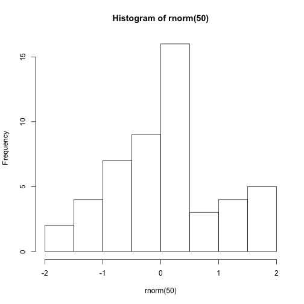

---
    title: "Statistic day"
    author: "Samantha Orlando"
    date: "2019-03-24"
    ---

     We generate a number `n=50` of 
    **Normal** disributed random variables 
    and plot them as an histogram
    
    
    ```r
     hist(rnorm(50))
    ```
    
    
